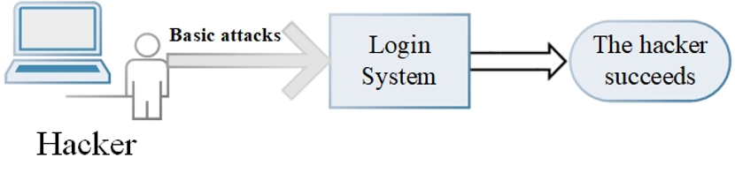
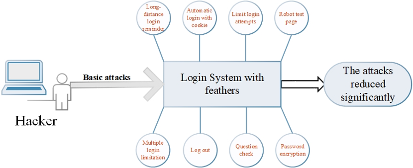
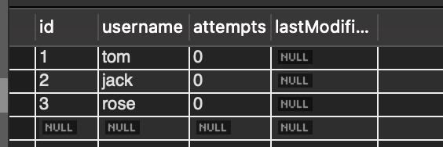

# Login page security

*ECS 153 - team YGZBSY - 5/10/2020*

## Introduction

Our data are guaranteed by password-protected online accounts — bank accounts， academic records, and more. The login system is almost a requirement for all applications. To provide security for users, We plan to develop a login system from the ground up, including front-end, back-end, database, etc. To enhance the security of the system, we'll add several features, like google reCAPTCHA. The second stage of our project is to look into the vulnerability of these features to improve them if it is possible. 

## what do you plan to build

The login system has the following features:

-  Long-distance login reminder 
- using Websocket technology for communication

- Automatic Logon with cookie
- limit login attempts
- robot test
- Multiple login limitation
- Question check
- Password encryption on database

The Volunabilities part may include bypass “slider CAPTCHA” with JS and Puppeteer. 

## what are your expected results 

- Applied the features and keep the best one or two so that the security is guaranteed and uses have the best experience. 
  - It limits multiple device logins that the last login edges out the previous one, a dialog pops up on the previous one and it automatically returns to re-login page.
  - It provides checkbox giving option of automatic login for seven days on the login page 
  - We’ll have a slider-verification-code to run the robot test.
  - We’ll set a limitation on login attempts. If the user goes beyond the limit, we’ll block the account temporarily, and provide a page to further verification.
  - Users can choose to log out automatically with long time no operations
  - When users register with email, users can set several questions for checking, which can be used as a security check for resetting passwords, etc.
- Reduce the attacks
- Figure out and fix the vulnerabilities of these features.

## Weekly work

## Week 7 - May, 8 to May, 14

My goal for this week is to implement google reCAPTCHA on the register page. Google reCAPTCHA can be used to recognize the robots. In this way, we can protect users' privacy. 

## week 8 - May, 15 to May, 21

My goal for this week is the implement Login Attempts limitation on the login page. Our account could be break in if the attackers have infinite times to try the actual password, which leaves a vulnerability to our system. So I want to add a login attempts limitation feature. Specifically, when we hit the limit amount of login, the user can’t try again, and the account will be locked. I'll set the limit amount of login to be three, and will give the notification to the user including the date of the last attempt.

I have finished setting up the MySQL contains the number of attempts, data of the last try, etc. In the backend, I have finished the DAO Classes, DAOImpl Classes, UserAttempts Classes, etc. However, I'm stuck on how to retrieve the database based on the username and update the date and the number of attempts. I planned to use some functions like `getJdbcTemplate().update`, but there is some conflict between Oracle and Spring Boot. I'll keep trying with my teammates for the next few days. 

## Week 9 - May, 22 to May, 28

My goal for this week is to implement the password encryption in the database. Although MySQL offers protection to our database, attackers could still break into our system, thus leaking the username and password. Besides, some users may use the same username and password for multiple applications. Therefore, extra protection should be placed on the database. This is where password-encryption kicks in. 

When users register a new account, in our database, his password will be stored as encrypted instead of the original string. 

As the image of Database goes, you can see the passwords have been encrypted. Consequently, even though attackers break into our database, they still can get the original password directly. 