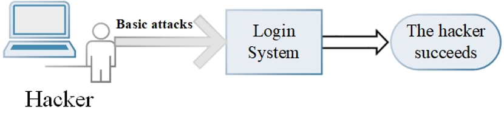
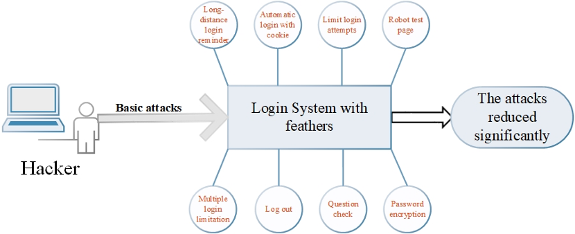

# Login page security

*ECS 153 - team YGZBSY - 5/10/2020*

## Introduction

Our data are guaranteed by password-protected online accounts — bank accounts， academic records, and more. The login system is almost a requirement for all applications. To provide security for users, We plan to develop a login system from the ground up, including front-end, back-end development, database, etc. To enhance the security of the system, we'll add several features, like google reCAPTCHA. The second stage of our project is to look into the vulnerability of these features to improve them if it is possible. 

## what do you plan to build

The login system has the following features:

-  Long-distance login reminder using Websocket technology for communication

- Automatic Logon with cookie
- limit login attempts
- robot test page,
- Multiple login limitation
- Question check
- Password encryption on database

The Volunabilities part may include bypass “slider CAPTCHA” with JS and Puppeteer. 

## what are your expected results 

- Applied the features and keep the best one or two so that the security is guaranteed and uses have the best experience. 
  - It limits multiple device logins that the last login edges out the previous one, a dialog pops up on the previous one and it automatically returns to re-login page.
  - It provides checkbox giving option of automatic login for seven days on the login page 
  - We’ll have a slider-verification-code to run the robot test.
  - We’ll set a limitation on login attempts. If the user goes beyond the limit, we’ll block the account temporarily, and provide a page to further verification.
  - Users can choose to log out automatically with long time no operations
  - When users register with email, users can set several questions for checking, which can be used as a security check for resetting passwords, etc.
- Reduce the attacks
- Figure out and fix the vulnerabilities of these features.

## Our concerns

How to attack our login system massively and record those attacks. 

